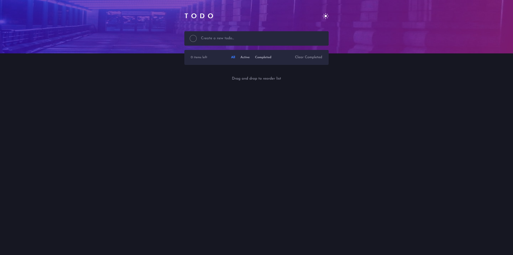

# Frontend Mentor - Todo app solution

This is a solution to the [Todo app challenge on Frontend Mentor](https://www.frontendmentor.io/challenges/todo-app-Su1_KokOW). Frontend Mentor challenges help you improve your coding skills by building realistic projects. 

### The challenge

Users should be able to:

- View the optimal layout for the app depending on their device's screen size
- See hover states for all interactive elements on the page
- Add new todos to the list
- Mark todos as complete
- Delete todos from the list
- Filter by all/active/complete todos
- Clear all completed todos
- Toggle light and dark mode
- **Bonus**: Drag and drop to reorder items on the list

### Screenshot

### Links

- Solution URL: [Github repo](https://github.com/JuaniSilva/TodoApp-Vue)
- Live Site URL: [Github Page](https://juanisilva.github.io/TodoApp-Vue/)

## My process
I started this project with only javascript and talwind, when I felt confortable I re did it in vue with out tailwind
### Built with

- Semantic HTML5 markup
- Native CSS
- Flexbox
- Mobile-first workflow
- [VueJS](https://v3.vuejs.org/) - Vue 3 library

### Continued development

I will continue updating this project with a more component based code :D

### Useful resources

- [Vue 3 Docs](https://v3.vuejs.org/guide/introduction.html) - This helped me with absolutley everything I didn't know about the framework
## Author

- Website - [Juani Silva](https://github.com/JuaniSilva)
- Frontend Mentor - [@JuaniSilva](https://www.frontendmentor.io/profile/JuaniSilva)
- Twitter - [@Juani_Silva13](https://twitter.com/Juani_Silva13)
